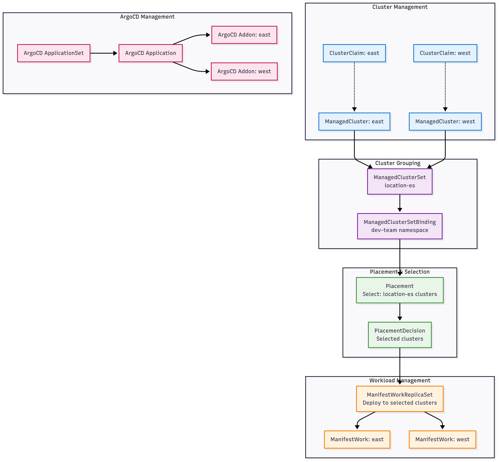

# Architecture Overview

This project sets up a **hub-and-spoke** model for Kubernetes multi-cluster management:

## 1. **Hub Cluster**
  - Runs OCM hub components
  - Hosts ArgoCD control plane
  - Manages placement policies

## 2. **Spoke Clusters (East, West)**
  - Join hub as managed clusters
  - Run OCM agents
  - Sync apps via ArgoCD agent

## 3.  **Networking**
  - Cilium CNI + Cluster Mesh for cross-cluster service discovery
  - MetalLB for LoadBalancer services
  - nginx-ingress for ingress management

## 4. **GitOps**
  - ArgoCD ensures apps are deployed consistently across clusters
  - ApplicationSets enable targeting based on labels and placements

## 5. Visuals

