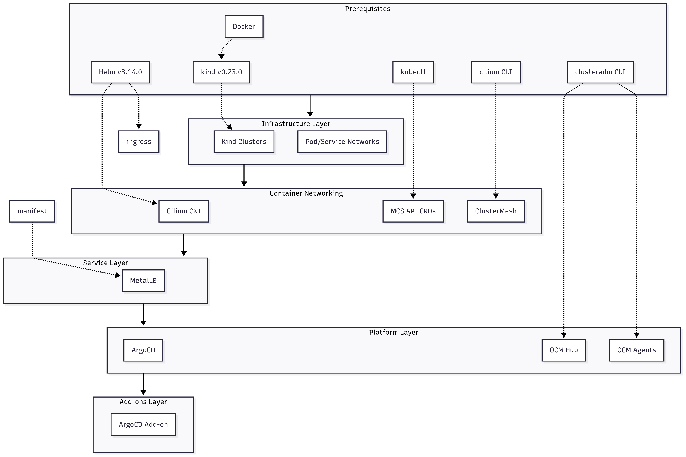

---

### 📄 `docs/INSTALLATION.md`
Step-by-step setup reference (expanded version of README quick start).

# Installation Guide

This document provides a detailed walkthrough of setting up **OCM + ArgoCD** demo environments using the automation script.

## 1. Install Prerequisites

- `docker`, `kind`, `kubectl`, `helm`, `cilium`, `clusteradm`

 - **kind**        : https://kind.sigs.k8s.io/docs/user/quick-start/#installation 
 - **kubectl** : https://kubernetes.io/docs/tasks/tools/
 - **helm** : https://helm.sh/docs/intro/install/
 - **cilium**: https://docs.cilium.io/en/stable/gettingstarted/k8s-install-default/
 - **clusteradm**: https://open-cluster-management.io/docs/getting-started/quick-start/
 - **docker**: https://docs.docker.com/engine/install/





## 2. Clone and Run Setup Script
```bash
git clone https://github.com/RajivBB/argo-mc-starter.git
cd argo-mc-starter
chmod +x scripts/ocm-argo-setup.sh
./scripts/ocm-argo-setup.sh
