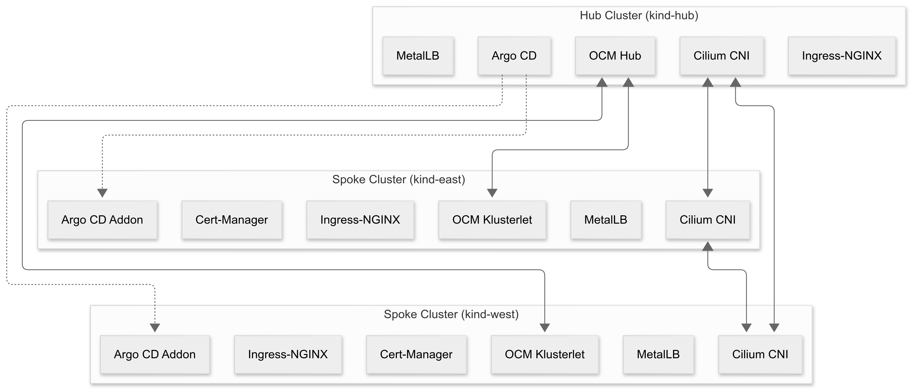

# Documentation

This project demonstrates how to set up a **multi-cluster Kubernetes environment** using **Open Cluster Management (OCM)** and **ArgoCD** with GitOps principles.  
It follows a **hub-and-spoke architecture** with automated placement, networking, and workload delivery.

---

## 1. Architecture Overview

The full **hub-and-spoke architecture** is shown below.  

- **Hub Cluster**:
  - Runs OCM Hub + ArgoCD control plane.
  - Manages placement and syncs applications.
- **Spoke Clusters (East, West)**:
  - Join hub as managed clusters.
  - Run OCM Agents + ArgoCD Agents.
  - Deploy workloads as directed.

Networking:  
- **Cilium ClusterMesh** enables cross-cluster service discovery.  
- **MCS API** provides service export/import.  
- **Ingress / MetalLB** handle external access.

---

## 2. Component Dependencies

This diagram shows the **layers of dependencies** in the environment.  
Starting from prerequisites (Docker, Kind, Helm, kubectl, clusteradm) all the way down to platform and add-ons.

Key layers:
- **Prerequisites**: Tooling required (`docker`, `kind`, `kubectl`, `helm`, `cilium`, `clusteradm`).
- **Infrastructure Layer**: Kind clusters and networking setup.
- **Container Networking**: Cilium CNI, Multi-Cluster Services CRDs, ClusterMesh.
- **Service Layer**: Ingress, MetalLB for LoadBalancer support.
- **Platform Layer**: ArgoCD, OCM Hub, OCM Agents.
- **Add-ons Layer**: Example: ArgoCD Add-on.

---

## 3. GitOps Workflow

This diagram illustrates the **GitOps flow** with ArgoCD and OCM.  

Steps:
1. Developer commits code to Git.
2. ArgoCD watches the repo (poll or webhook).
3. ApplicationSet generates application manifests.
4. OCM placement policies decide which clusters should run the apps.
5. OCM agents on spoke clusters receive and apply the workloads.
6. ArgoCD agents deploy workloads into the clusters.
7. Health/status is reported back to the hub.

---

## 4. OCM Resource Relationships

This diagram highlights how **OCM resources** interact for cluster grouping, placement, and workload management.  

Flow:
- `ClusterClaim` → `ManagedCluster`
- `ManagedClusterSet` → `ManagedClusterSetBinding`
- `Placement` → `PlacementDecision`
- `ManifestWorkReplicaSet` → `ManifestWorks` per cluster
- ArgoCD Applications are layered on top as workloads.

---

## 5. End-to-End Flow

The sequence diagram ties everything together into a **step-by-step execution order**.  

Steps:
1. Create Hub, East, and West clusters.
2. Install CRDs, Cilium, MetalLB, Ingress.
3. Deploy ArgoCD on the Hub.
4. Initialize OCM hub and join spoke clusters.
5. Accept managed clusters and enable addons.
6. Enable ClusterMesh for cross-cluster networking.
7. Apply sample manifests to see workloads deployed.

---

## Summary

With these layers:
- **Prerequisites + Infrastructure** provide the base clusters.
- **Networking + Services** ensure connectivity.
- **Platform (OCM + ArgoCD)** provide orchestration and GitOps.
- **Add-ons + Workloads** deliver applications across clusters.

This repo is a **hands-on starting point** for exploring multi-cluster GitOps with ArgoCD and OCM.
